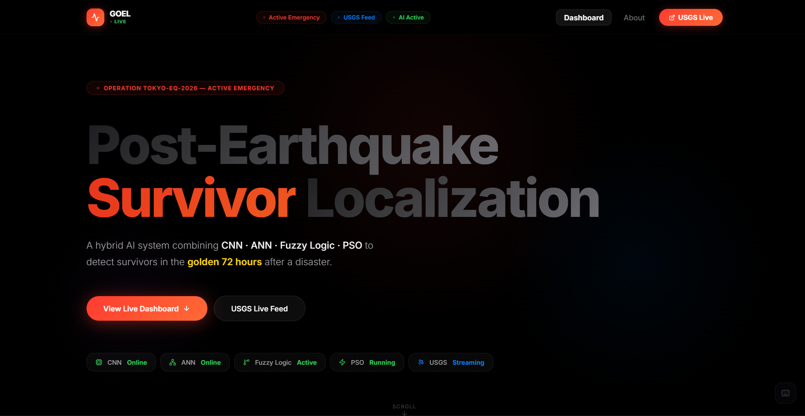

<div align="center">

# GOEL — *The Rescuer*

### Post-Earthquake Survivor Localization System

*A hybrid soft computing platform that combines CNN · ANN · Fuzzy Logic · PSO to detect and locate survivors within the critical 72-hour golden window.*

[](https://jeswinbenedict.github.io/Goel-AI)
[](#ai-pipeline-architecture)
[](https://earthquake.usgs.gov)
[](https://react.dev)
[](https://flask.palletsprojects.com)
[](LICENSE)

[Live Demo](https://jeswinbenedict.github.io/Goel-AI) · [Report Bug](https://github.com/jeswinbenedict/Goel-AI/issues) · [Request Feature](https://github.com/jeswinbenedict/Goel-AI/issues)

</div>

---

## The Problem

After a major earthquake, survival probability drops to near zero after **72 hours**. Most disaster response systems rely on manual coordination, delayed communication, and fragmented data. Rescue teams waste precious time deciding *where to go* instead of *saving lives*.

**GOEL** (Hebrew for "The Rescuer") changes that. It is a fully automated AI pipeline that activates the moment an earthquake is detected — processing thermal imagery, computing survival probabilities, classifying risk zones, and routing rescue teams — all without waiting for human instructions.

---

## System Overview



> **Operation TOKYO-EQ-2026 — Active.**
> Every subsystem is running. CNN is processing thermal feeds. ANN is computing survival probabilities. Fuzzy Logic is scoring zones. PSO is routing teams. USGS is streaming live seismic data.

---

## Live Operations Dashboard


The dashboard is the central command interface — hydrated via REST on load and continuously updated through WebSocket events.

| Metric | Value | Status |
|--------|-------|--------|
| Survivors Detected | 14 | +2 in last hour |
| Rescue Teams Active | 6 | 3 currently en route |
| Critical Zones | 3 | Immediate action required |
| Hours Since Quake | 18 | 54 hours remaining |

### Fuzzy Zone Classification

| Zone | Score Range | Directive |
|------|------------|-----------|
| 🔴 **CRITICAL** | 78 – 100 | Deploy rescue team immediately |
| 🟡 **MODERATE** | 40 – 77 | Deploy within 2 hours |
| 🟢 **LOW** | 0 – 39 | Assign remote monitoring |

The rescue map renders live via **Leaflet + OpenStreetMap**. Survivors, teams, and zone boundaries are plotted with color-coded markers. Critical zones pulse. Rescued survivors fade to gray.

---

## Mission Status — 72-Hour Countdown


| Operation | Progress | Completion |
|-----------|----------|------------|
| Survivors Detected | 14 / 14 | 100% |
| Rescue Dispatched | 9 / 14 | 64% |
| Active Operations | 6 / 9 | 67% |
| Successfully Rescued | 7 / 14 | 50% |

A real-time countdown timer tracks the remaining hours in the golden 72-hour window. The overall mission progress bar aggregates all rescue operations with animated fill transitions.

---

## Field Intelligence


### Survivor Detection Panel
Each survivor card displays real-time data: **location, CNN confidence score, fuzzy zone classification, heat signature, and current status** (detected → dispatched → rescued). Cards update automatically via WebSocket as the backend simulation advances.

### PSO Route Optimizer
The optimizer assigns rescue teams to survivors using Particle Swarm Optimization. One click triggers the Flask backend to compute the globally optimal assignment.

| Team | Members | Assignment | Distance | ETA |
|------|---------|-----------|----------|-----|
| Alpha | 4 | Survivor #1 & #2 — Block A | 0.4 km | 8 min |
| Bravo | 3 | Survivor #3 — Block B, Floor 3 | 0.9 km | 15 min |
| Charlie | 5 | Survivor #4 & #5 | 1.2 km | 22 min |

> **Graceful degradation**: When the backend is unreachable, the frontend falls back to static data and local computation — the dashboard never goes blank.

---

## AI Analysis & Seismic Intelligence


### CNN Thermal Imaging
Upload any thermal image via drag-and-drop. The backend runs it through the convolutional network and returns: **survivor count, confidence score, heat signature, zone classification, and processing time**.

### USGS Live Earthquake Feed
The system connects to the [USGS Real-Time API](https://earthquake.usgs.gov/earthquakes/feed/v1.0/summary/significant_month.geojson) via the Flask backend. If the backend is down, the frontend fetches directly from USGS as a fallback. Each event shows magnitude, location, depth, and timestamp.

---

## Live Diagnostics


### Seismic Waveform Analysis
P-waves and S-waves are plotted in real time using **Recharts**. The time gap between P-wave and S-wave arrival estimates distance to epicenter. Toggle **LIVE** mode for continuously streaming waveform data via WebSocket.

### Fuzzy Logic Interactive Tester
Three adjustable sliders control the fuzzy inference inputs:

| Input | Weight | Range |
|-------|--------|-------|
| 🌡 Heat Signature Score | ×0.45 | 0 – 100% |
| 🏚 Void Probability | ×0.35 | 0 – 100% |
| 📡 Signal Strength | ×0.20 | 0 – 100% |

Drag the sliders to see the **zone classification update in real time**. Click "Run via Flask Backend" to call the real `scikit-fuzzy` Mamdani inference engine on the server.

---

## AI Model Visualizers


### CNN Confidence Chart
Bar chart showing detection confidence per survivor. Scores **above 70%** trigger immediate dispatch. Color-coded by zone (Critical / Moderate / Low). Powered by real-time survivor data from the WebSocket feed.

### ANN Survival Predictor
Interactive predictor with three inputs:
- **Building Type** — Reinforced Concrete, Steel Frame, Masonry, Wood, Unreinforced
- **Floor Number** — 1 to 20
- **Earthquake Magnitude** — 5.0M to 9.0M

Computes **survival probability** and **void space probability** in real time using a weighted neural network model.

---

## Swarm Optimization — PSO Live Visualization


A **canvas-rendered particle swarm simulation** that visualizes 28 particles converging on 5 survivor targets. Each particle draws a fading trail as it navigates toward its assigned survivor.

| Parameter | Value |
|-----------|-------|
| Algorithm | Particle Swarm Optimization |
| Inertia (w) | 0.72 |
| Cognitive coefficient (c₁) | 1.5 |
| Social coefficient (c₂) | 2.0 |
| Active particles | 28 |
| Max velocity | 3.5 |

The visualization auto-starts when scrolled into view and updates at 60fps via `requestAnimationFrame`.

---

## AI Pipeline Architecture


```
Drone Input → CNN → ANN → Fuzzy Logic → PSO → Rescue Dispatch
```

| Stage | Model | Function | Performance |
|-------|-------|----------|-------------|
| 1 | **CNN** | Thermal image analysis → survivor detection | 94.2% accuracy · 5 Conv + 3 FC layers |
| 2 | **ANN** | Structural data → survival probability | 91.7% precision · 3 Hidden (128→64→32) |
| 3 | **Fuzzy Logic** | Multi-signal fusion → zone classification | 48 IF-THEN rules · Mamdani FIS |
| 4 | **PSO** | Zone priorities + team positions → optimal routes | 30 particles × 100 iterations |

Each stage card in the UI is **expandable** — click to reveal detailed inputs, outputs, and architecture specifications.

---

## Mission Report & Timeline


### Survivor Timeline
A vertical timeline that logs every operation event with timestamps, status icons, and expandable descriptions. Events are sourced from the real-time engine and update automatically.

### PDF Export
One-click **professional PDF report** generated client-side using `jsPDF`. Includes:
- Seismic event summary
- Operation statistics (survivors, rescued, teams, zones)
- AI models deployed
- Full survivor detection log with zones and confidence scores

---

## Architecture

```
┌─────────────────────────────────────────────────────────────┐
│                        FRONTEND                             │
│  React 19 · Tailwind CSS v4 · Vite 8 · Port 5174           │
│  Recharts · Leaflet · Socket.io-client · jsPDF              │
├─────────────────────────────────────────────────────────────┤
│              ↕ REST (initial hydration)                      │
│              ↕ WebSocket (continuous updates)                │
├─────────────────────────────────────────────────────────────┤
│                        BACKEND                              │
│  Flask · Flask-SocketIO · eventlet · Port 5000              │
│  scikit-fuzzy · NumPy · SciPy · NetworkX                    │
├─────────────────────────────────────────────────────────────┤
│                     EXTERNAL DATA                           │
│  USGS Earthquake API · OpenStreetMap                        │
└─────────────────────────────────────────────────────────────┘
```

### Real-Time Engine
The backend runs **background workers** via `eventlet` that simulate live operations:
- **Earthquake monitor** — Polls USGS API every 60s
- **Survivor simulator** — Updates survivor states, zones, and confidence scores
- **Seismic stream** — Generates synthetic waveform data at 5Hz
- **PSO recalculation** — Re-optimizes routes every 30s

State is managed in a **thread-safe singleton** (`realtime/state.py`) using `threading.Lock`. The frontend's `RealtimeProvider` context hydrates initially via `GET /api/state` and then subscribes to Socket.io events for continuous updates.

### REST API

| Endpoint | Method | Description |
|----------|--------|-------------|
| `/api/state` | GET | Full state snapshot for initial hydration |
| `/api/health` | GET | System heartbeat + model status |
| `/api/fuzzy-score` | POST | Run Mamdani fuzzy inference (`heat`, `void`, `hours`) |
| `/api/optimize-routes` | POST | Execute PSO for survivor/team coordinates |
| `/api/earthquake-live` | GET | Fetch current USGS significant earthquakes |
| `/api/analyze-thermal` | POST | Simulate CNN thermal analysis |

### WebSocket Events

| Event | Direction | Payload |
|-------|-----------|---------|
| `state_update` | Server → Client | Full state snapshot |
| `survivor_update` | Server → Client | Updated survivor list |
| `seismic_data` | Server → Client | Waveform data point |
| `route_update` | Server → Client | PSO route results |
| `request_pso` | Client → Server | Trigger PSO recalculation |

---

## Project Structure

```
Goel-AI/
├── backend/
│   ├── app.py                  # Flask + SocketIO entry point
│   ├── Procfile                # Gunicorn + eventlet deployment
│   ├── requirements.txt        # Python dependencies
│   ├── api/
│   │   └── routes.py           # REST API endpoints
│   ├── realtime/
│   │   ├── engine.py           # Background workers & simulation loops
│   │   └── state.py            # Thread-safe state singleton
│   └── utils/
│       ├── fuzzy_engine.py     # scikit-fuzzy Mamdani inference
│       └── pso_optimizer.py    # Particle Swarm Optimization
│
├── goel-website/
│   ├── package.json
│   ├── vite.config.js          # Vite 8 + Tailwind CSS v4
│   └── src/
│       ├── App.jsx             # Router (Home, About, 404)
│       ├── main.jsx            # Entry point
│       ├── api/client.js       # Axios API client
│       ├── realtime/
│       │   └── RealtimeProvider.jsx  # Socket.io context provider
│       ├── hooks/
│       │   └── useInView.js    # Intersection Observer + parallax
│       ├── styles/
│       │   └── theme.js        # Design system (colors, cards, badges)
│       ├── pages/
│       │   ├── Home.jsx        # Main dashboard (18 widgets)
│       │   ├── About.jsx       # Project overview & AI architecture
│       │   └── NotFound.jsx    # 404 with auto-redirect
│       └── components/
│           ├── StatsDashboard.jsx     # Live stat cards
│           ├── RescueMap.jsx          # Leaflet map with zones
│           ├── CountdownTimer.jsx     # 72-hour countdown
│           ├── RescueProgress.jsx     # Operation progress bars
│           ├── SurvivorPanel.jsx      # Survivor detail cards
│           ├── RouteOptimizer.jsx     # PSO team assignment
│           ├── ThermalUploader.jsx    # CNN image upload
│           ├── EarthquakeFeed.jsx     # USGS live feed
│           ├── SeismicChart.jsx       # P/S-wave waveform
│           ├── FuzzyTester.jsx        # Interactive fuzzy demo
│           ├── FuzzyZoneCard.jsx      # Zone classification cards
│           ├── CNNConfidenceChart.jsx  # Bar chart per survivor
│           ├── ANNPredictor.jsx       # Survival probability calc
│           ├── PSOVisualizer.jsx      # Canvas swarm animation
│           ├── AlgorithmFlowchart.jsx # Expandable pipeline cards
│           ├── SurvivorTimeline.jsx   # Operation event log
│           ├── ExportReport.jsx       # PDF report generator
│           ├── DemoMode.jsx           # Auto-scroll guided tour
│           └── ConnectionStatus.jsx   # WebSocket status indicator
│
├── assets/                     # Screenshots for README
├── .github/workflows/
│   └── deploy.yml              # GitHub Pages CI/CD
└── README.md
```

---

## Getting Started

### Prerequisites

- **Node.js** ≥ 18
- **Python** ≥ 3.9
- **npm** or **yarn**

### Installation

```bash
# Clone the repository
git clone https://github.com/jeswinbenedict/Goel-AI.git
cd Goel-AI
```

### Backend

```bash
cd backend
pip install -r requirements.txt
python app.py
# Server starts on http://localhost:5000
```

### Frontend

```bash
cd goel-website
npm install
npm run dev
# App opens at http://localhost:5174
```

> **Note**: The frontend works independently even if the backend is down. All components gracefully fall back to local simulation data and static defaults.

### Production Build

```bash
cd goel-website
npm run build        # Output in dist/
npm run preview      # Preview production build
```

### Deploy to GitHub Pages

```bash
cd goel-website
npm run deploy       # Builds and pushes to gh-pages branch
```

---

## Tech Stack

| Category | Technologies |
|----------|-------------|
| **Frontend** | React 19, Vite 8, Tailwind CSS v4, Recharts, Leaflet, Framer Motion, Lucide Icons |
| **Real-Time** | Socket.io (client + server), Flask-SocketIO, eventlet |
| **AI / ML** | scikit-fuzzy (Mamdani FIS), PSO (custom), CNN/ANN (simulated) |
| **Backend** | Python Flask, NumPy, SciPy, NetworkX, Requests |
| **Data Sources** | USGS Earthquake API, OpenStreetMap |
| **Export** | jsPDF (client-side PDF generation) |
| **Deployment** | GitHub Pages (frontend), Render/Gunicorn (backend) |
| **CI/CD** | GitHub Actions |

---

## Demo Mode

The app includes a built-in **Demo Tour** — a floating control bar at the bottom of the screen that automatically scrolls through all 10 dashboard sections with a progress indicator, section labels, and manual navigation controls. Click ▶ to start.

---

## License

MIT — Use it. Improve it. Deploy it. Save lives.

---

<div align="center">

**The first 18 minutes determine whether people are found.**
**The next 54 hours determine whether they survive.**
**GOEL exists to win both.**

Built by [Jeswin Benedict](https://github.com/jeswinbenedict)

</div>
